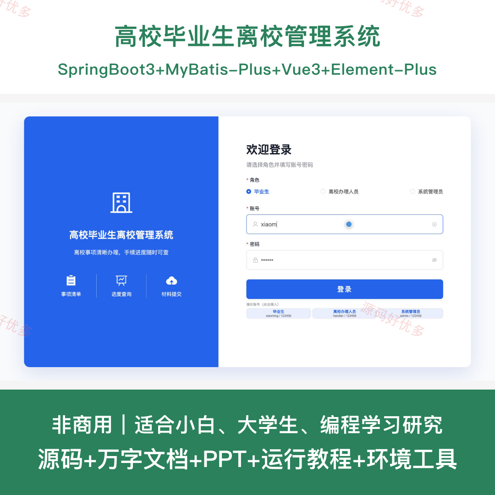
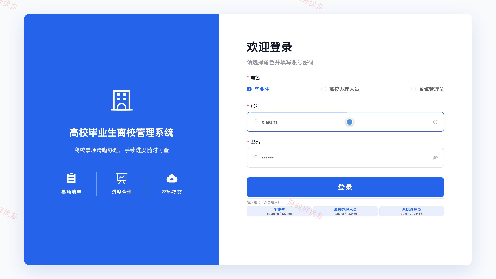
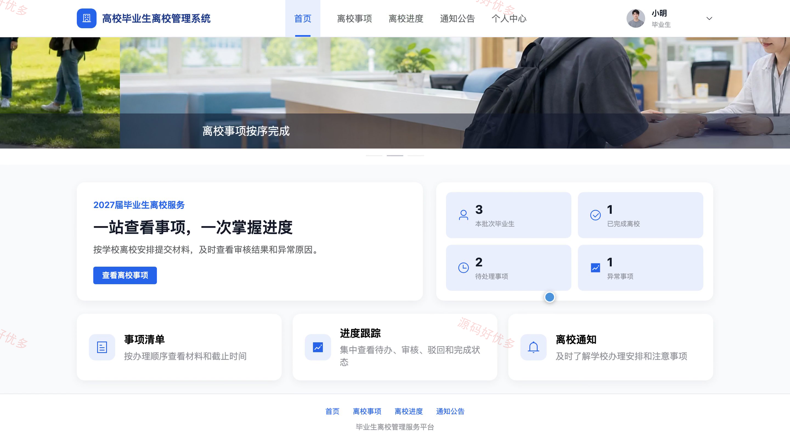
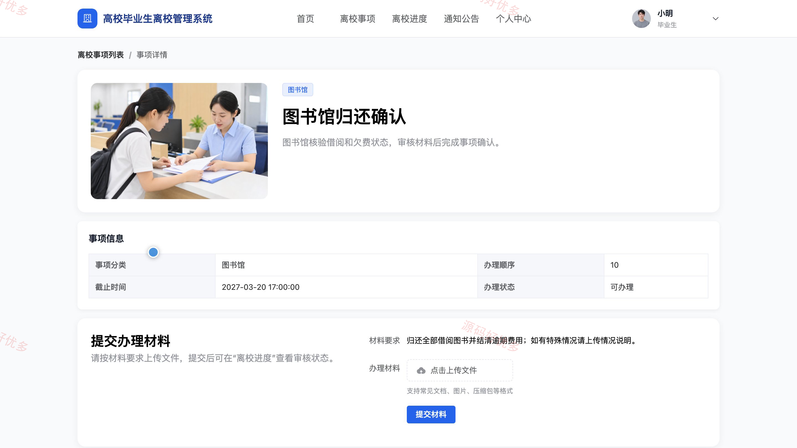
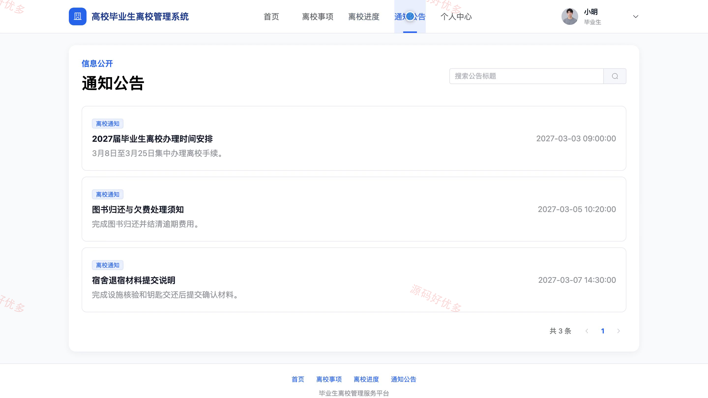
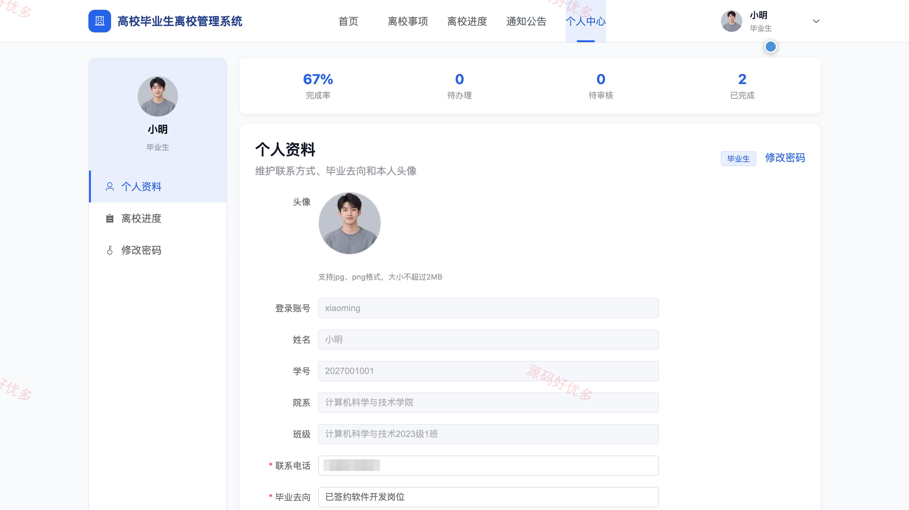
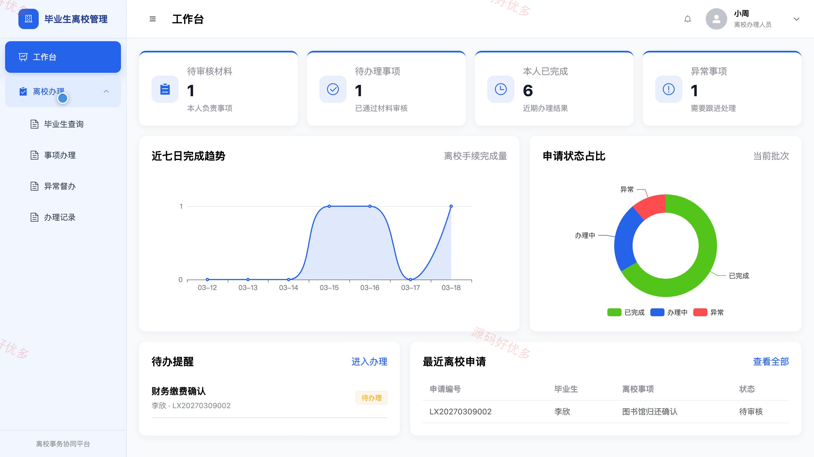
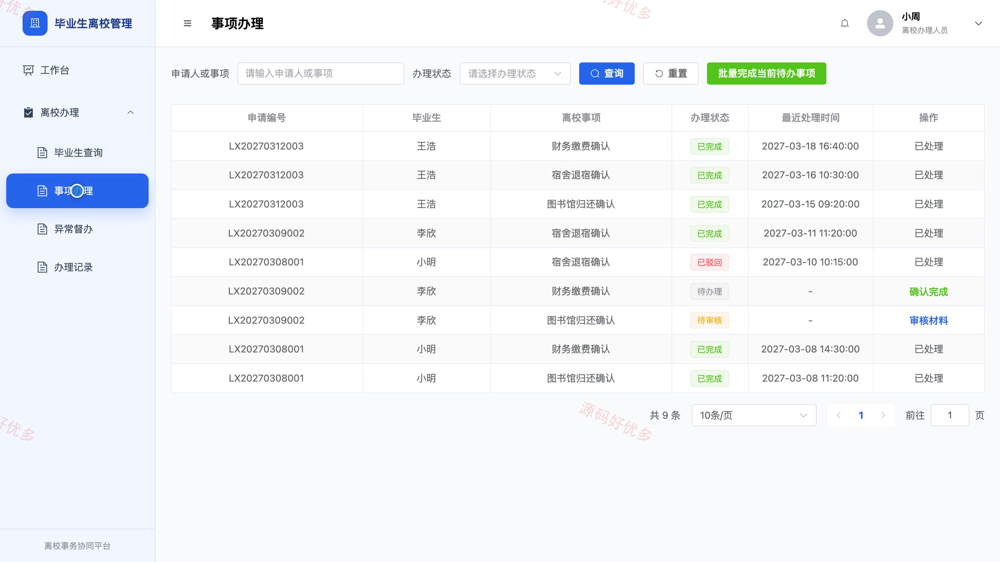
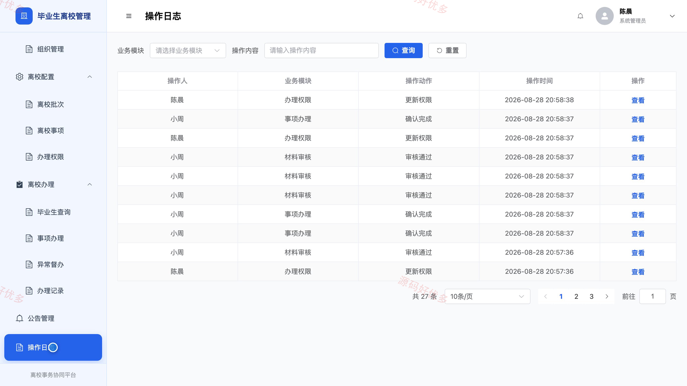

## 源码问题查看主页咨询

### 一、关键词
毕业生离校服务、离校手续办理、毕业手续管理、校园事务协同、离校进度查询

### 二、作品包含
源码+数据库+万字设计文档+PPT+全套环境和工具资源+本地部署教程

### 三、项目技术
前端技术： Html、Css、Js、Vue3.4、Element-Plus
后端技术：Java、SpringBoot3.2.0、MyBatis-Plus

### 四、运行环境（以下版本亲测，其他版本兼容性请自行测试）
开发工具：IDEA/eclipse + VSCODE

数据库：MySQL5.7+（共11张表）

数据库管理工具：Navicat10以上版本

环境配置软件： JDK17 + Maven

前端Nodejs：16+

浏览器：谷歌浏览器

### 五、项目介绍
项目编号：bs097A

高校毕业生离校管理系统面向毕业生、离校办理人员和系统管理员，围绕离校申请、材料提交、事项审核、异常督办和进度统计构建统一办理流程，支持个人事项清单、办理状态追踪与手续单下载。

角色：毕业生、离校办理人员、系统管理员

毕业生功能：离校事项查看、离校申请与材料提交、办理进度查询、异常原因查看与材料补充、离校手续单下载、个人资料维护、密码修改、通知公告查看。

离校办理人员功能：办理工作台、毕业生查询、事项材料审核、离校事项确认、同类事项批量确认、异常事项跟进、办理记录查询。

系统管理员功能：账号与组织管理、离校批次管理、离校事项管理、办理权限配置、离校进度监督、异常事项督办、公告管理、操作日志查询。

### 六、运行截图

